# QQ技术讨论群464087747

# 详解v1.0 v3.0 测试使用以及各个模块详细教程qq 1923962282@qq.com

# Mat
### 1,Introduce
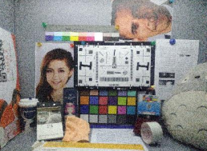
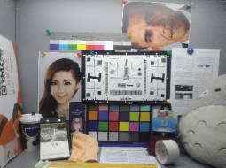

 Matlib Is an open source (C / C + +) image algorithm library, It can be used under multiple platforms(Window, Linux, Android), It contains all kinds of conventional image processing algorithms, all functions adopt the underlying optimization technology, include (Neon, Openmp, Linebuf, Mempool, and so on) ,Its performance is faster than OpenCV, The code is only 1M, which is very simplified and has no dependency，It is very convenient to use, We can use the neon instruction on the window platform, Development and use is very friendly, which can quickly integrate developers into their own code.

### 2,Frame structure
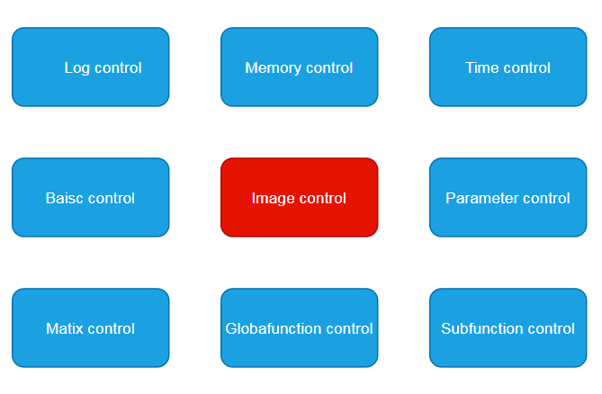

 Here we briefly describe the core class of mat basic image library (parent class mat.h file) 
Subclasses contain (MultIntImage, MultiShortImage, MultiUcharImage, MultiUshortImage, SingleUcharImage, Yuv420Image), They contain various basic image processing algorithms, We can use them to process images such as RAW RGB GRAY YUV.
For detailed code usage, please refer to the example file.
### 3,How to compile a project
* Window platform: We can use vs2017 to compile(open ISPpipeline.sln)
* Linux platform: We can use g++ to compile(待更新)
* Android platform: We can use ndk to compile(待更新)

# ---------------------------V2.0-----------------------------
### 3,Example for surperlowlight(wait for..)
# 注意事项本算法要求是多帧ev0和多帧ev-x(详细参考demo教材)
#### 测试图片demo下载链接：https://pan.baidu.com/s/16XVxTN2ZYpmAyLvccWG8qw 
#### 提取码：aaaa
#### 标定工具下载：待更新xxxxxxxxxxxxxxxxxxxxxxxxxxxxxxx
#### 提取码：aaaa
#### 基于mat surperlowlight 框架图

#### 1,常规配置
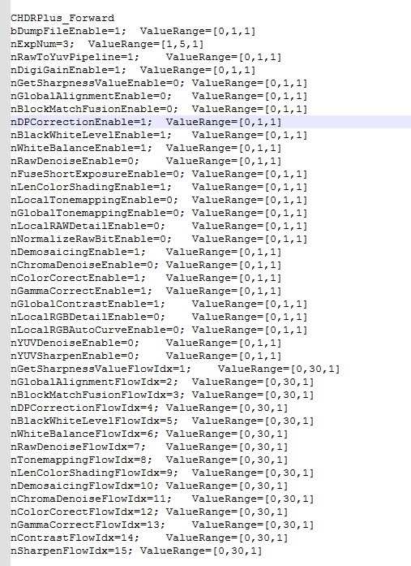
#### 效果图如图：
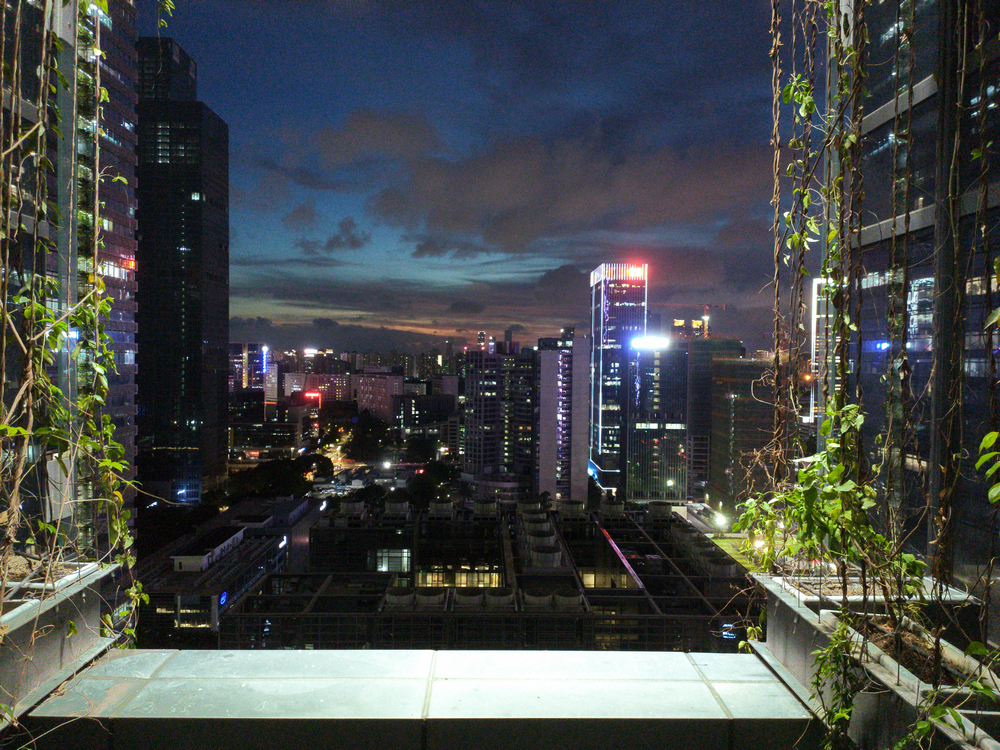

#### 2,surperlowlight效果配置

#### 效果图如图：

#### 3,细节对比
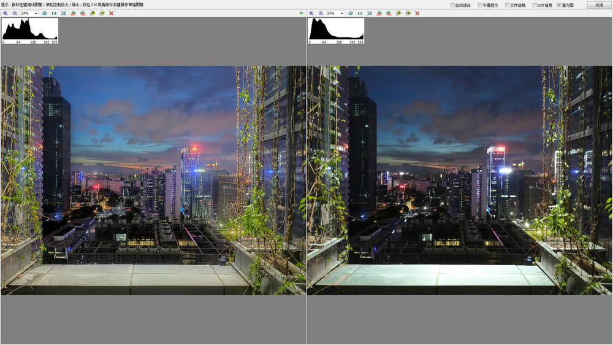

# ---------------------------V1.0-----------------------------
### 4,Example for hdrplus(https://github.com/jhfmat/ISP-pipeline-hdrplus/releases/tag/v1.0)
# 注意事项本算法要求是多帧短曝光raw
#### 测试图片demo下载链接：https://pan.baidu.com/s/1Gs8tz1zapDAFcpNJJ0bHeQ 
#### 提取码：aaaa
####(DecedeCR2.exe文件将.CR2文件解码到.raw文件和生成相关的参数文件.txt,ISPpipeline.exe是一套isp将raw处理到bmp流程)
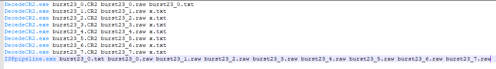
#### 基于mat hdrplus 框架图
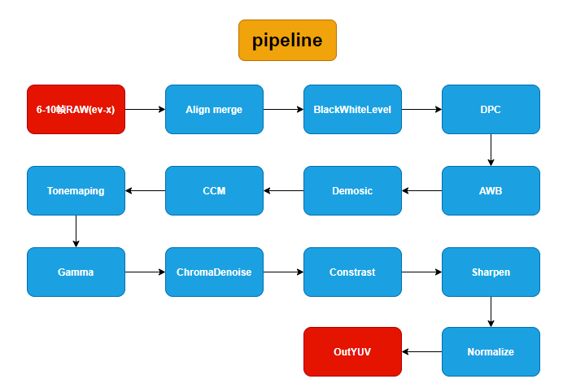

#### 1,打开网络参数文件
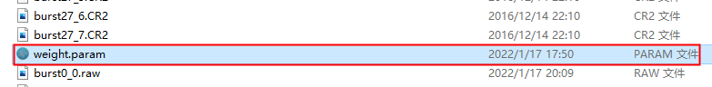

#### 2,关闭isp种核心三个模块
* nBlockMatchFusionEnable=0;	ValueRange=[0,1,1] 多帧去噪
* nChromaDenoiseEnable=0;	ValueRange=[0,1,1] 去除彩色噪声
* nTonemappingEnable=0;	ValueRange=[0,1,1] 动态范围压缩
#### 如图：

 
#### 3,运行run23.bat

 
#### Outbmp目录下生成Normalize.bmp如图：

 
#### 4,打开网络模块开启上述三个模块如图：
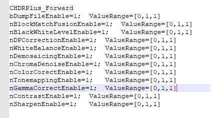
 
#### 删除outbmp/Normalize.bmp 再次运行run23.bat
#### outbmp目录下生成Normalize.bmp图如下：

 

#### 5,下载hdrplus里面的demo测试结果图项目链接
#### https://github.com/timothybrooks/hdr-plus
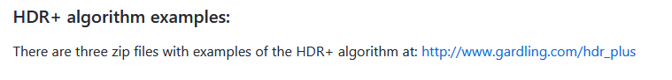

 
#### 6,解压001压缩包找到里面output23.png
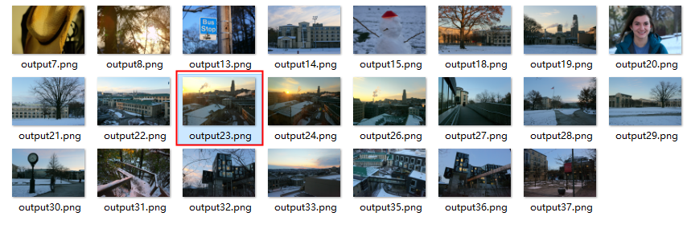
 
#### hdrplus测试结果图
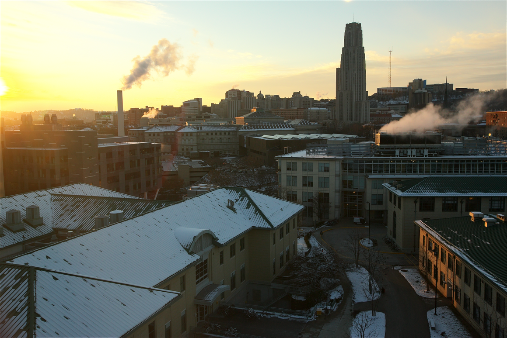

#### 7,三张图整体对比
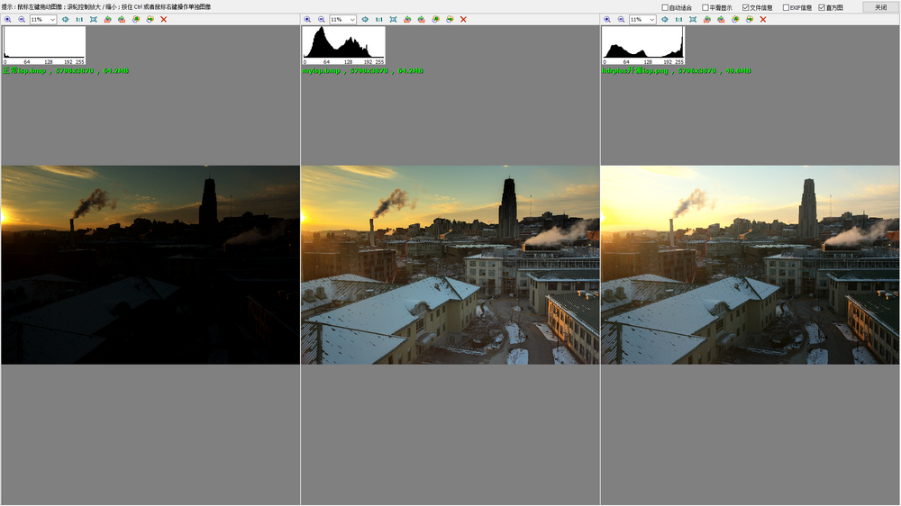
#### 8,三张细节对比

