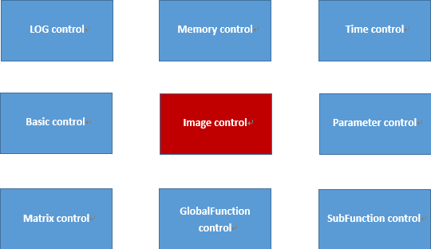

Matlib
1, Introduce

Matlib Is an open source (C / C + +) image algorithm library, It can be used under multiple platforms(Window, Linux, Android), It contains all kinds of conventional image processing algorithms, all functions adopt the underlying optimization technology, include (Neon, Openmp, Linebuf, Mempool, and so on) ,Its performance is faster than OpenCV, The code is only 1M, which is very simplified and has no dependency，It is very convenient to use, We can use the neon instruction on the window platform, Development and use is very friendly, which can quickly integrate developers into their own code.

2, Frame structure

Here we briefly describe the core class of mat basic image library (parent class mat. H file) 
Subclasses contain (MultIntImage, MultiShortImage, MultiUcharImage, MultiUshortImage, SingleUcharImage, Yuv420Image), They contain various basic image processing algorithms, We can use them to process images such as RAW RGB GRAY YUV.
For detailed code usage, please refer to the example file.
3, How to compile a project
Window platform: We can use vs2017 to compile(open Mat.vcxproj)
Linux platform: We can use g++ to compile(/Linux/ build.cmd)
Android platform: We can use ndk to compile(/android/Jni/ build.cmd)