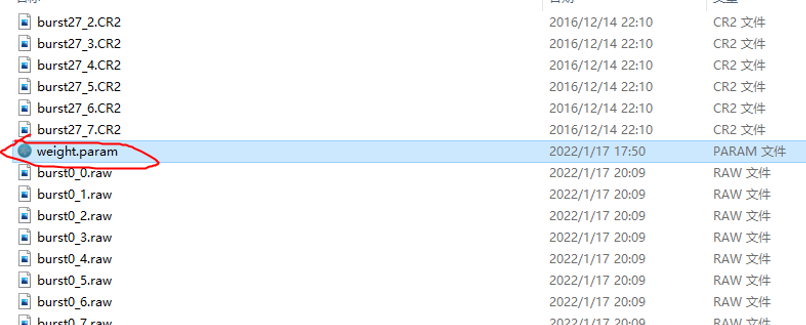
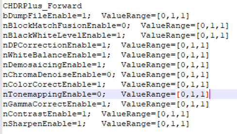
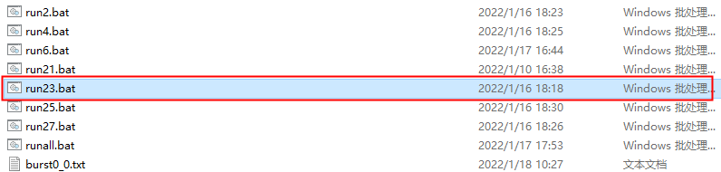
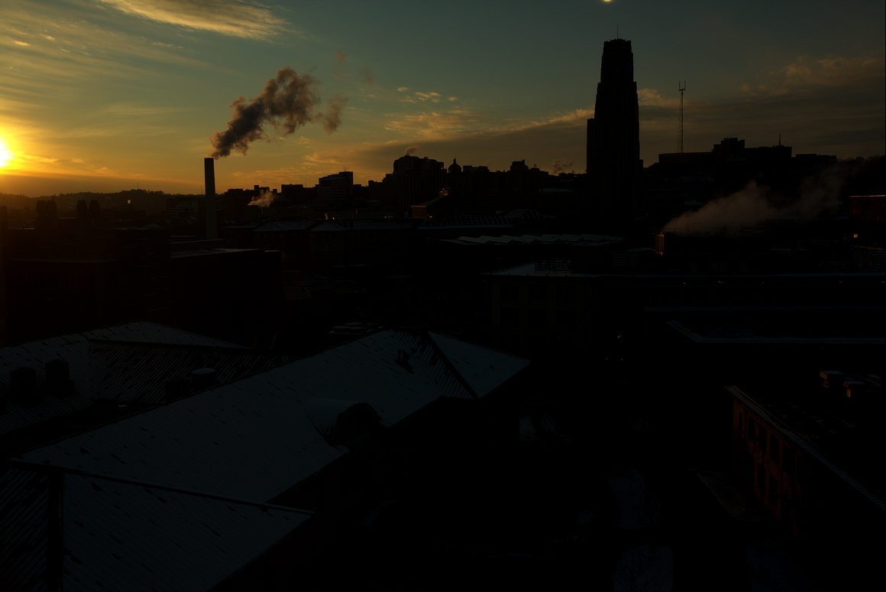
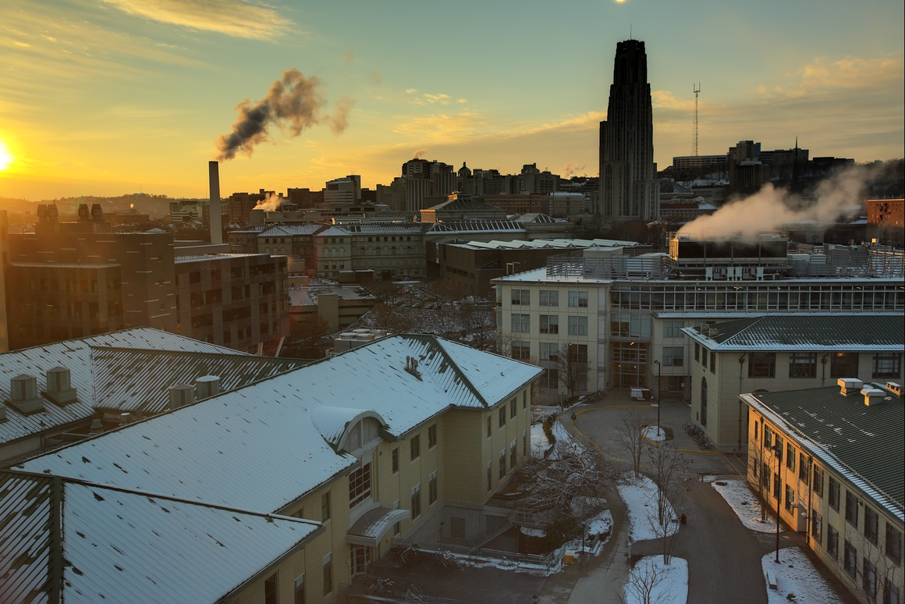
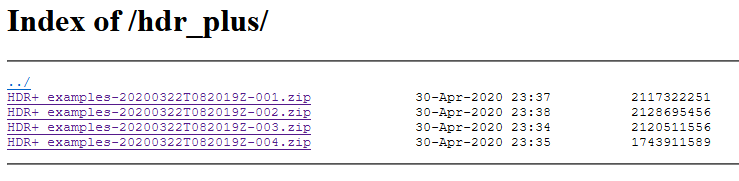
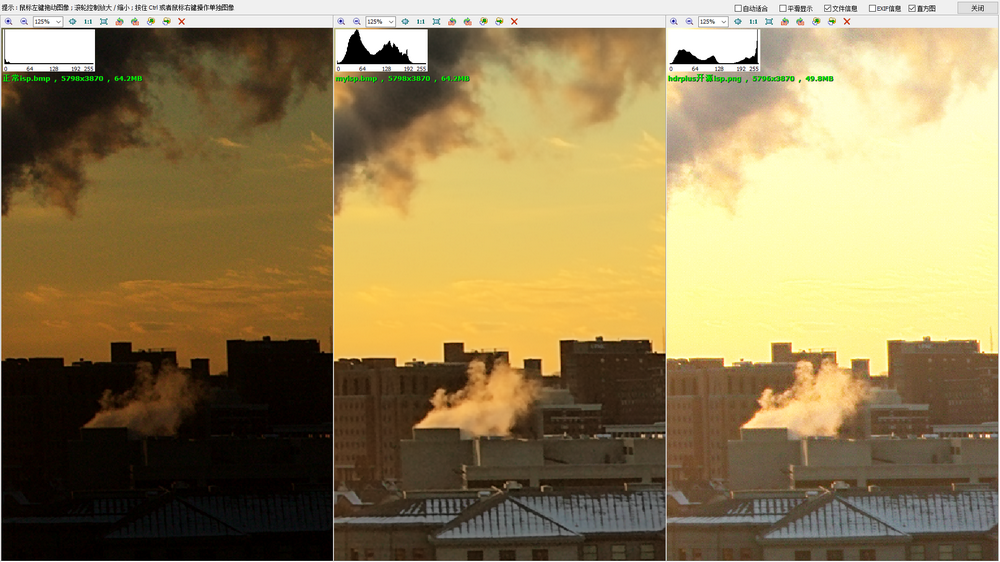

# Mat
### 1,Introduce

 Matlib Is an open source (C / C + +) image algorithm library, It can be used under multiple platforms(Window, Linux, Android), It contains all kinds of conventional image processing algorithms, all functions adopt the underlying optimization technology, include (Neon, Openmp, Linebuf, Mempool, and so on) ,Its performance is faster than OpenCV, The code is only 1M, which is very simplified and has no dependency，It is very convenient to use, We can use the neon instruction on the window platform, Development and use is very friendly, which can quickly integrate developers into their own code.

### 2,Frame structure

 Here we briefly describe the core class of mat basic image library (parent class mat. H file) 
Subclasses contain (MultIntImage, MultiShortImage, MultiUcharImage, MultiUshortImage, SingleUcharImage, Yuv420Image), They contain various basic image processing algorithms, We can use them to process images such as RAW RGB GRAY YUV.
For detailed code usage, please refer to the example file.
### 3,How to compile a project
* Window platform: We can use vs2017 to compile(open Mat.vcxproj)
* Linux platform: We can use g++ to compile(/Linux/ build.cmd)
* Android platform: We can use ndk to compile(/android/Jni/ build.cmd)

### 4,example for hdrplus
测试图片demo下载链接
链接：https://pan.baidu.com/s/1PdGphn8Z5f7zKtkReOgmhg 
提取码：aaaa
(DecedeCR2.exe文件将.CR2文件解码到.raw文件和生成相关的参数文件.txt,ISPpipeline.exe是一套isp将raw处理到bmp流程)

#### 基于mat hdrplus 框架图

#### 1,打开网络参数文件

#### 2,关闭isp种核心三个模块
* nBlockMatchFusionEnable=0;	ValueRange=[0,1,1] 多帧去噪
* nChromaDenoiseEnable=0;	ValueRange=[0,1,1] 去除彩色噪声
* nTonemappingEnable=0;	ValueRange=[0,1,1] 动态范围压缩
#### 如图：

 
#### 3,运行run23.bat

 
#### Outbmp目录下生成Normalize.bmp如图：

 
#### 4,打开网络模块开启上述三个模块如图：

 
#### 删除outbmp/Normalize.bmp 再次运行run23.bat
#### outbmp目录下生成Normalize.bmp图如下：

 

#### 5,下载hdrplus里面的demo测试结果图项目链接
#### https://github.com/timothybrooks/hdr-plus

#### hdrplus测试结果图

 
#### 6,解压001压缩包找到里面output23.png

 

#### 7,三张图整体对比

#### 8,三张细节对比

